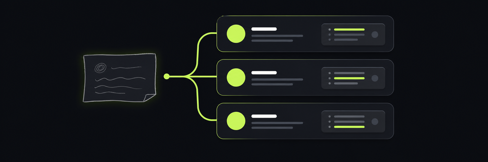
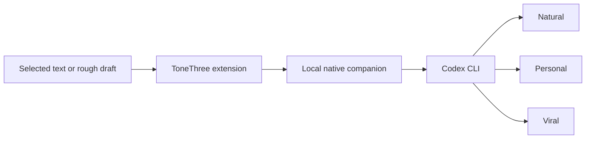

<div align="center">
  

  # ToneThree

  **Turn one rough thought into three posts that still sound like you.**

  [](https://github.com/anmolmoses/tonethree/releases)
  [](LICENSE)
  [](#requirements)
  [](#install)
</div>



ToneThree is a local Chrome and Edge extension that rewrites a rough thought
into three distinct Twitter/X options:

- **Natural**: relaxed, clear, simple, and conversational
- **Personal**: reflective and emotionally honest without invented details
- **Viral**: a strong true hook, crisp rhythm, and a memorable ending without clickbait

It corrects grammar while preserving the writer's meaning, personality, facts,
numbers, language, and tone. ToneThree calls the Codex CLI installed on your
computer and reuses its ChatGPT subscription login. No API key is stored in the
extension.

## Why ToneThree

Most rewriting tools sand away the writer's personality. ToneThree is built
around stricter rules:

- Preserve the central message and point of view
- Never invent facts, emotions, experiences, or achievements
- Avoid corporate language, clichés, fake wisdom, and obvious AI phrasing
- Never add hashtags unless they are already intentional
- Never use em dashes
- Use line breaks only when they improve readability
- Keep the writing focused without imposing a character limit

## Features

- Three consistent writing directions on every run
- Reads selected text or the currently focused editor
- Right-click shortcut for selected and editable content
- Built-in draft editor before sending anything to Codex
- One-click copy
- Replace the original text directly on supported pages
- Temporary `activeTab` access instead of permanent access to every website
- Ephemeral, read-only Codex runs
- Structured JSON output for reliable UI rendering
- Native Chrome and Edge support on Windows

## How it works



The browser sandbox cannot launch local programs directly, so ToneThree uses a
small .NET native-messaging companion. The companion accepts only the draft and
a fixed action, invokes `codex exec` with a read-only ephemeral session, validates
the structured response, and returns the three versions to the popup.

## Requirements

- Windows 10 or 11
- Google Chrome or Microsoft Edge
- Node.js and npm
- .NET 8 SDK
- A Codex-enabled ChatGPT subscription

The installer detects whether a callable Codex CLI is available. The private
`codex.exe` bundled with the Microsoft Store desktop app cannot be launched by
browser extensions, so ToneThree installs the supported `@openai/codex` npm CLI
when necessary.

## Install

Clone the repository:

```powershell
git clone https://github.com/anmolmoses/tonethree.git
cd tonethree
```

Run the Windows installer:

```powershell
powershell -ExecutionPolicy Bypass -File .\scripts\install.ps1
```

If authentication is needed, run the exact login command printed by the
installer and choose **Sign in with ChatGPT**.

Then load the browser extension:

1. Open `chrome://extensions` or `edge://extensions`.
2. Enable **Developer mode**.
3. Select **Load unpacked**.
4. Choose the repository's `extension` directory.
5. Pin ToneThree to the toolbar.

Close and reopen the browser after the first install so it inherits the local
CLI path.

## Use

### Toolbar

1. Select text on a webpage or click inside an editor.
2. Open ToneThree from the toolbar.
3. Review or edit the captured draft.
4. Select **Create 3 variations**.
5. Switch between Natural, Personal, and Viral.
6. Copy the result or replace the original text on the page.

### Context menu

Right-click selected or editable text and choose
**Rewrite as Natural, Personal & Viral**.

The replace action supports standard inputs, textareas, and most
`contenteditable` editors. Highly customized editors may require copying and
pasting manually.

## Privacy and security

- The extension receives temporary access only to the active tab.
- Drafts travel from the browser to a local native-messaging process.
- CLI credentials never pass into extension JavaScript.
- Codex runs with `read-only`, `never` approval, and `ephemeral` settings.
- The companion does not allow the browser to supply commands or CLI arguments.
- Processing follows the policies and usage limits of the ChatGPT workspace
  authenticated through `codex login`.

ToneThree is an independent open-source project and is not an official OpenAI
product.

## Project structure

```text
tonethree/
├── assets/              Brand and README images
├── extension/           Manifest V3 browser extension
│   └── icons/           Browser icon sizes
├── native-host/         .NET native-messaging companion
├── scripts/             Windows install and uninstall scripts
├── LICENSE
└── README.md
```

## Development

Build the native companion:

```powershell
dotnet build .\native-host\ToneThree.NativeHost.csproj -c Release
```

Check extension JavaScript:

```powershell
node --check .\extension\background.js
node --check .\extension\popup.js
```

After changing the manifest, click **Reload** for ToneThree on the browser's
extensions page. After changing the native host, rerun `scripts/install.ps1`
with `-SkipCliInstall`.

## Troubleshooting

### Native messaging host not found

Run the installer again, then completely restart the browser.

### Microsoft Store `codex.exe` says access denied

Use the exact `codex.cmd` login path printed by the installer. The Store app's
private binary is intentionally skipped.

### Codex is not signed in

Run:

```powershell
& "$env:APPDATA\npm\codex.cmd" login
```

Choose ChatGPT sign-in in the browser window.

### Changes do not appear in the popup

Open `chrome://extensions` or `edge://extensions` and click **Reload** on
ToneThree.

## Uninstall

Remove ToneThree from the browser, then run:

```powershell
powershell -ExecutionPolicy Bypass -File .\scripts\uninstall.ps1
```

## License

Released under the [MIT License](LICENSE).
